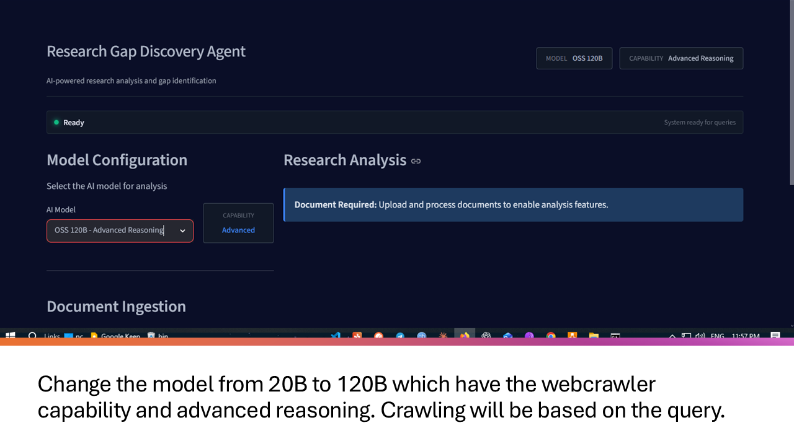
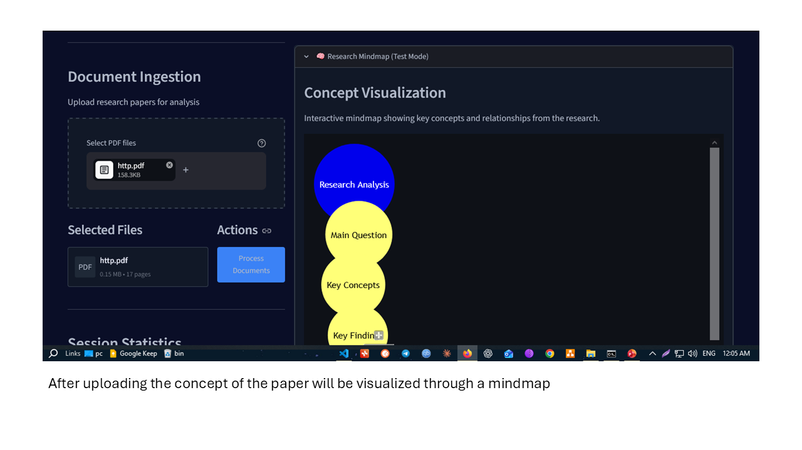
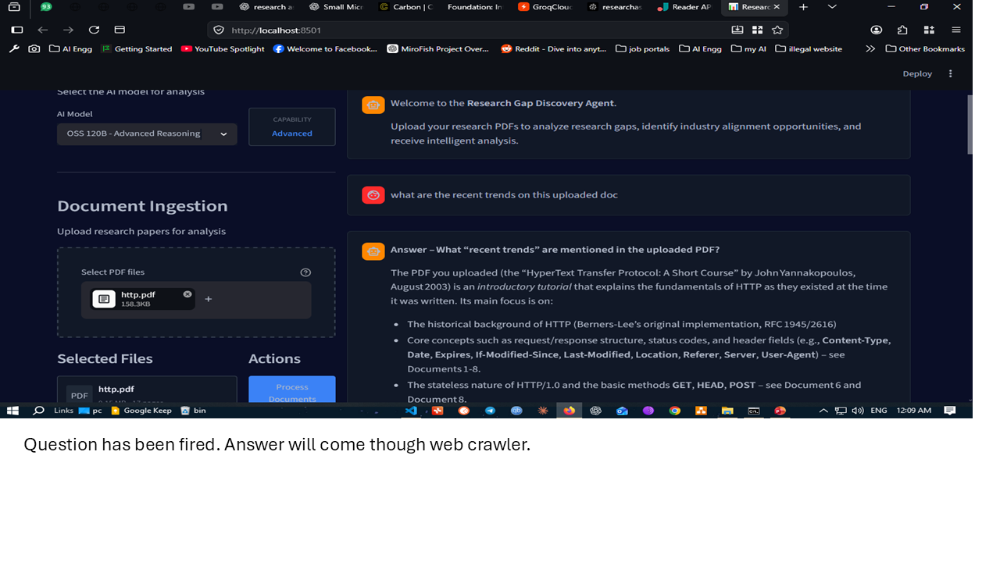
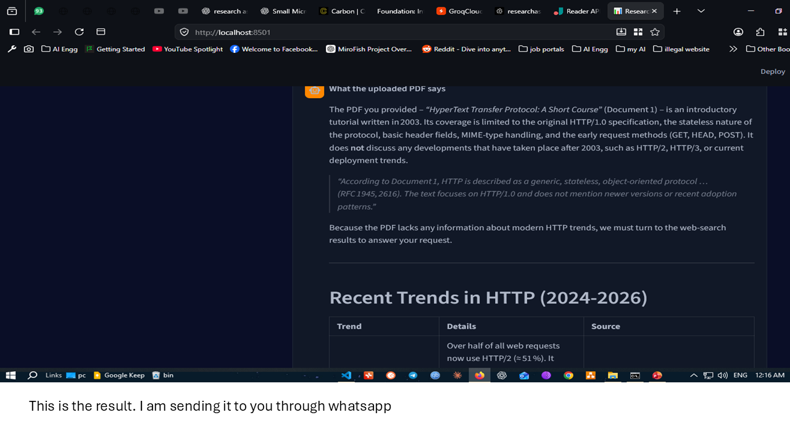
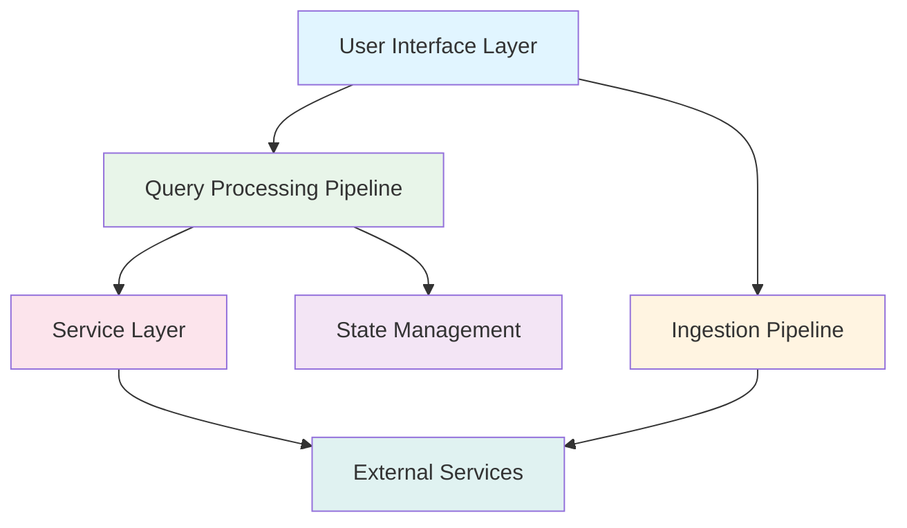
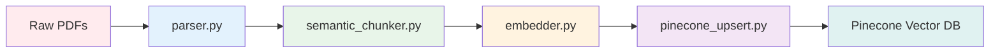
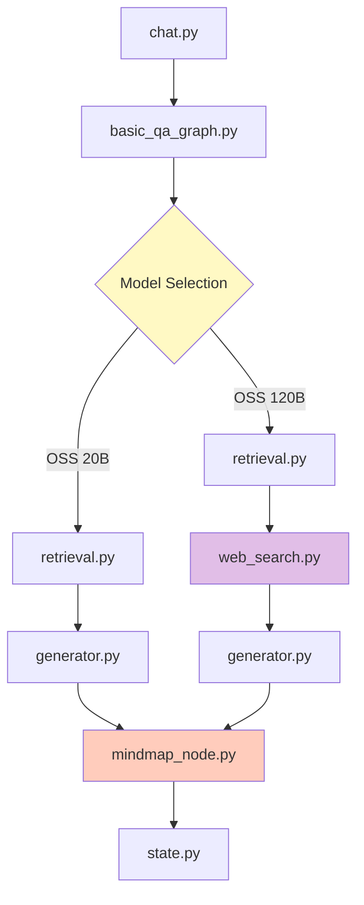
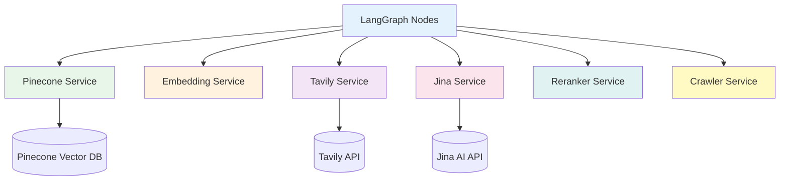

# 📊 Research Gap Discovery and Industry Alignment Agent

<div align="center">

[](https://www.python.org/)
[](https://langchain-ai.github.io/langgraph/)
[](https://langchain.com/)
[](https://streamlit.io/)
[](https://www.pinecone.io/)
[](https://groq.com/)
[](https://tavily.com/)
[](https://jina.ai/)
[](https://pymupdf.readthedocs.io/)
[](https://github.com/py-pdfium/pymupdf4llm)
[](https://www.sbert.net/)
[](https://pytorch.org/)
[](https://huggingface.co/)
[](https://mermaid.js.org/)
[](LICENSE)

**A sophisticated multi-agent RAG system that ingests research papers, indexes them semantically, and runs a LangGraph-orchestrated Q&A pipeline to surface cross-paper research gaps — enriched with live web search for industry alignment when deeper reasoning is needed.**

[Overview](#-overview) · [Architecture](#-architecture) · [Quick Start](#-getting-started) · [Tech Stack](#-tech-stack) · [Project Structure](#-project-structure) · [Architecture Exploration](#-exploring-the-architecture)

</div>

---

## 🎯 Overview

Researchers and engineers often need to answer a deceptively hard question: *"What's actually missing between what's published and what the industry needs?"* This agent automates that workflow — ingesting a batch of PDFs, indexing them into a vector store, and running an LLM-orchestrated pipeline that retrieves, reasons, optionally pulls in real-time web context, and visualizes findings as an interactive mindmap.

The system is organized as two pipelines and a shared state object, modeled as a fully interconnected component graph (documented and explorable as an Obsidian vault):

- **Ingestion Pipeline** — raw PDFs → parsed text → semantic chunks → embeddings → vector DB
- **Query Pipeline** — a LangGraph workflow: retrieval → web search → generation → mindmap
- **Shared State (`ResearchState`)** — carries conversation, retrieval, generation, and cross-paper analysis data through every node

---

## 📸 Project Screenshots

### System Interface
The main Streamlit interface provides an intuitive environment for uploading research papers and interacting with the intelligent Q&A system.



### PDF Ingestion Process
Users can drag and drop research papers which are automatically processed through the semantic chunking pipeline.



### Query Processing & Results
The system processes natural language queries using the LangGraph-orchestrated pipeline, retrieving relevant information from ingested papers and live web search when needed.



### Interactive Mindmap Visualization
For complex queries requiring deep reasoning, the system generates interactive mindmaps that visualize the relationships between concepts and research findings.



---

## 🏗️ Architecture

The system architecture is visualized as an interactive canvas in the Obsidian vault, showing the complete data flow and component relationships. The architecture consists of six main layers:

### System Layers



### Canvas Architecture Flow

The canvas architecture (available in `obsidian_vault/level3dfd_final.canvas`) provides a detailed visual representation of the system:

**Ingestion Flow:**
```
UI (app.py) → uploader.py → pdf_ingestion.py → parser.py → semantic_chunker.py → embedder.py → pinecone_upsert.py → Pinecone Vector DB
```

**Query Flow:**
```
UI (app.py) → chat.py → basic_qa_graph.py → retrieval.py → web_search.py → generator.py → mindmap_node.py → state.py
```

**Model Selection Paths:**
- **OSS 20B Path:** `retrieval → generator` (fast inference, 3000 tokens)
- **OSS 120B Path:** `retrieval → web_search → generator → mindmap` (advanced reasoning, 4000 tokens)

---

## 🎨 User Interface Layer

### Components

| Component | File | Responsibility |
|-----------|------|----------------|
| **Streamlit UI** | `app.py` | Main application entry point — file upload, chat interface, model selection, session management |
| **File Uploader** | `src/research_gap_agent/ui/uploader.py` | Normalizes and serializes uploaded PDF files into standardized dictionaries |
| **Chat Builder** | `src/research_gap_agent/ui/chat.py` | Constructs chat payload (messages, files, query context) passed into the LangGraph workflow |

### Key Features
- Drag-and-drop PDF upload interface
- Real-time chat interface with streaming responses
- Model selection (OSS 20B vs OSS 120B)
- Session state management
- Interactive mindmap visualization

---

## 📥 Ingestion Pipeline

### Pipeline Overview

The ingestion pipeline transforms raw PDFs into semantically indexed vector representations:



### Components

| Component | File | Responsibility |
|-----------|------|----------------|
| **Ingestion Orchestrator** | `src/research_gap_agent/Ingestion/pdf_ingestion.py` | Coordinates the entire ingestion pipeline end-to-end |
| **PDF Parser** | `src/research_gap_agent/Ingestion/parser.py` | Extracts text and metadata via `pymupdf4llm`, with `PyMuPDF` fallback |
| **Semantic Chunker** | `src/research_gap_agent/Ingestion/semantic_chunker.py` | Strips references/boilerplate, isolates abstract & intro, generates summary chunk, then splits content into semantic chunks |
| **Embedder** | `src/research_gap_agent/Ingestion/embedder.py` | Generates embeddings for each chunk using sentence-transformers |
| **Pinecone Upsert** | `src/research_gap_agent/Ingestion/pinecone_upsert.py` | Batches and uploads embedded chunks to Pinecone, namespaced per file |

### Processing Details

**Parser:** Uses `pymupdf4llm` as the primary parser for LLM-optimized markdown extraction, with `PyMuPDF` as fallback for robust PDF handling.

**Semantic Chunker:** Implements intelligent document segmentation:
- Removes references, acknowledgments, and boilerplate content
- Isolates abstract and introduction for enhanced retrieval
- Generates a summary chunk for document-level context
- Splits remaining content into semantic chunks based on topic boundaries

**Embedder:** Uses `sentence-transformers` with the `all-MiniLM-L6-v2` model (384 dimensions) for efficient embedding generation.

---

## 🔍 Query Processing Pipeline (LangGraph)

### Pipeline Overview

The query pipeline uses LangGraph for orchestration, enabling conditional routing based on model selection and context requirements:



### Components

| Component | File | Responsibility |
|-----------|------|----------------|
| **Graph Orchestrator** | `src/research_gap_agent/graphs/basic_qa_graph.py` | Defines the LangGraph workflow with conditional routing |
| **Retrieval Node** | `src/research_gap_agent/nodes/retrieval.py` | Embeds the query, runs similarity search against Pinecone (top-K), ranks results |
| **Web Search Node** | `src/research_gap_agent/nodes/web_search.py` | Conditionally (deep-reasoning model only) searches the web via Tavily and extracts content via Jina AI |
| **Generator Node** | `src/research_gap_agent/nodes/generator.py` | Builds the RAG prompt from PDF + web context and generates the answer |
| **Mindmap Node** | `src/research_gap_agent/nodes/mindmap_node.py` | Conditionally generates a structured concept mindmap from the answer |

### Conditional Routing

**OSS 20B Path (Fast Inference):**
- Token limit: 3000 tokens
- Path: `retrieval → generator`
- Use case: Straightforward Q&A with sufficient PDF context

**OSS 120B Path (Advanced Reasoning):**
- Token limit: 4000 tokens
- Path: `retrieval → web_search → generator → mindmap`
- Use case: Complex reasoning requiring web context and visualization

---

## 🧠 State Management

### ResearchState

The `ResearchState` class (defined in `src/research_gap_agent/state/state.py`) serves as the central state object that flows through all nodes in the LangGraph workflow.

### State Structure

```python
class AgentState(TypedDict, total=False):
    # Conversational & Input State
    messages: Annotated[List[BaseMessage], add_messages]
    query: str
    selected_llm: Optional[str]
    
    # Document & Processing State
    uploaded_files: List[str]
    file_payloads: List[Dict[str, Any]]
    parsed_documents: List[Dict[str, Any]]
    vector_store_path: Optional[str]
    
    # Analysis & Extraction State
    metadata: Dict[str, PaperMetadata]
    analysis_results: Dict[str, AnalysisResults]
    
    # Synthesis & Global Discovery State
    cross_paper_gaps: List[str]
    industry_gap_alignment: Dict[str, Any]
    
    # Flow Control & Errors
    current_node: str
    errors: List[str]
    
    # Retrieval & Generation State
    retrieved_docs: Optional[List[Dict[str, Any]]]
    answer: Optional[str]
    target_namespace: Optional[str]
    
    # Web Search State (for oss120B model)
    web_search_performed: bool
    web_search_results: Optional[Dict[str, Any]]
    web_search_query: Optional[str]
    pdf_context_sufficient: bool
    
    # Mindmap State (for oss120B model)
    mindmap_generated: bool
    mindmap_data: Optional[Dict[str, Any]]
```

### Key Features
- **Type-safe state management** using TypedDict
- **Message accumulation** via LangGraph's `add_messages` annotation
- **Conditional state fields** for different model paths
- **Error tracking** across the pipeline
- **Cross-paper analysis** aggregation

---

## 🤖 LLM Layer

### Components

| Component | File | Responsibility |
|-----------|------|----------------|
| **LLM Factory** | `src/research_gap_agent/llm/factory.py` | Instantiates the correct model based on selection |
| **OSS 20B** | `src/research_gap_agent/llm/oss20B.py` | Fast-inference model (3000 token limit) |
| **OSS 120B** | `src/research_gap_agent/llm/oss120B.py` | Advanced-reasoning model (4000 token limit) — triggers web search & mindmap generation |

### Model Comparison

| Feature | OSS 20B | OSS 120B |
|---------|---------|----------|
| **Token Limit** | 3000 tokens | 4000 tokens |
| **Inference Speed** | Fast | Slower |
| **Reasoning Capability** | Standard | Advanced |
| **Web Search** | No | Yes |
| **Mindmap Generation** | No | Yes |
| **Use Case** | Simple Q&A | Complex analysis |

---

## 🔧 Service Layer

### Components

| Component | File | Responsibility |
|-----------|------|----------------|
| **Pinecone Service** | `src/research_gap_agent/services/pinecone_service.py` | Connection, query, and namespace management for Pinecone |
| **Embedding Service** | `src/research_gap_agent/services/embedding_service.py` | Core embedding logic used by both ingestion and query-time retrieval |
| **Tavily Service** | `src/research_gap_agent/services/tavily_service.py` | Web search API integration |
| **Jina Service** | `src/research_gap_agent/services/jina_service.py` | Web content extraction |
| **Reranker Service** | `src/research_gap_agent/services/reranker_service.py` | Reranks retrieved/search results for relevance |
| **Crawler Service** | `src/research_gap_agent/services/crawler_service.py` | Deeper web crawling for supplementary content |

### Service Architecture



---

## 🛠️ Utilities

### Components

| Component | File | Responsibility |
|-----------|------|----------------|
| **File Store** | `src/research_gap_agent/utils/file_store.py` | Manages saving uploaded files to disk and path validation |

---

## 🔌 External Services

### Service Integrations

| Service | Purpose | Configuration |
|---------|---------|---------------|
| **Pinecone** | Vector storage & similarity search (index: `researchassistant`, 384-dim) | Environment variable: `PINECONE_API_KEY` |
| **Tavily Search API** | Real-time web search | Environment variable: `TAVILY_API_KEY` |
| **Jina AI** | Web content extraction | Environment variable: `JINA_API_KEY` |
| **Groq** | LLM inference (OSS 20B / OSS 120B) | Environment variable: `GROQ_API_KEY` |
| **pymupdf4llm / PyMuPDF** | PDF parsing | No API key required |

### Configuration Setup

**Option 1: Using API Keys File (Recommended for Development)**

1. Copy the example file:
   ```bash
   cp api_keys.txt.example api_keys.txt
   ```

2. Edit `api_keys.txt` with your actual API keys:
   ```
   pinecone key : your_pinecone_api_key
   tavily key : your_tavily_api_key
   jina key : your_jina_api_key
   groq key : your_groq_api_key
   ```

**Option 2: Using Environment Variables**

Set environment variables instead:
```bash
export PINECONE_API_KEY=your_pinecone_api_key
export TAVILY_API_KEY=your_tavily_api_key
export JINA_API_KEY=your_jina_api_key
export GROQ_API_KEY=your_groq_api_key
```

**⚠️ Security Note:** Never commit `api_keys.txt` or any files containing real API keys to version control. The `.gitignore` file is configured to prevent this.

---

## 🚀 Tech Stack

| Layer | Technology |
|-------|------------|
| **Language** | Python 3.11+ |
| **Orchestration** | LangGraph |
| **UI Framework** | Streamlit |
| **LLM Framework** | LangChain |
| **LLM Provider** | Groq — GPT-OSS 20B (fast) & GPT-OSS 120B (deep reasoning) |
| **PDF Parsing** | pymupdf4llm (primary), PyMuPDF (fallback) |
| **Chunking** | Custom semantic chunker |
| **Embeddings** | sentence-transformers (`all-MiniLM-L6-v2`, 384-dim) |
| **Vector DB** | Pinecone |
| **Web Search** | Tavily |
| **Content Extraction** | Jina AI Reader |
| **Visualization** | Mermaid.js via `streamlit-mermaid` |

---

## ✨ Key Features

- **Dual-model routing** — fast 20B model for straightforward Q&A; 120B model for deep reasoning, web search, and mindmap generation
- **Semantic chunking** — boilerplate removal, abstract/intro isolation, and summary-chunk generation to boost retrieval quality
- **Hybrid retrieval** — prioritizes ingested PDF content, supplements with live web search only when local context is insufficient
- **Cross-paper gap analysis** — aggregates per-paper metadata and analysis results to surface research gaps and industry alignment across the uploaded corpus
- **Interactive mindmaps** — LLM-generated concept maps rendered directly in the UI
- **Fully mapped architecture** — the entire component graph is documented as an interlinked Obsidian vault for interactive exploration (graph view, backlinks, tag filtering)
- **Stateful conversations** — maintains conversation context across multiple queries
- **Conditional execution** — intelligent routing based on model selection and context requirements

---

## 📈 Performance Characteristics

| Metric | Value |
|--------|-------|
| **Ingestion speed** | ~5–30s per PDF |
| **Query response** | ~3–20s end-to-end |
| **Retrieval latency** | ~200–600ms |
| **Embedding speed** | ~100–500ms per chunk |
| **Web search latency** | ~1–3s (when triggered) |
| **Mindmap generation** | ~2–5s (when triggered) |

---

## 📁 Project Structure

```
research-gap-discovery-agent/
├── obsidian_vault/              # Interactive architecture documentation
│   ├── level3dfd_final.canvas   # Canvas architecture visualization
│   ├── _Index.md               # Architecture index
│   └── [component files].md    # Individual component documentation
├── src/
│   └── research_gap_agent/
│       ├── Ingestion/          # PDF ingestion pipeline
│       │   ├── parser.py
│       │   ├── semantic_chunker.py
│       │   ├── embedder.py
│       │   ├── pinecone_upsert.py
│       │   └── pdf_ingestion.py
│       ├── graphs/             # LangGraph workflow definition
│       │   └── basic_qa_graph.py
│       ├── nodes/              # LangGraph nodes
│       │   ├── retrieval.py
│       │   ├── web_search.py
│       │   ├── generator.py
│       │   └── mindmap_node.py
│       ├── llm/                # LLM factory + model implementations
│       │   ├── factory.py
│       │   ├── oss20B.py
│       │   └── oss120B.py
│       ├── services/           # External service integrations
│       │   ├── pinecone_service.py
│       │   ├── embedding_service.py
│       │   ├── tavily_service.py
│       │   ├── jina_service.py
│       │   ├── reranker_service.py
│       │   └── crawler_service.py
│       ├── state/              # State management
│       │   └── state.py
│       ├── ui/                 # Streamlit UI components
│       │   ├── uploader.py
│       │   └── chat.py
│       └── utils/              # Utilities
│           └── file_store.py
├── app.py                      # Streamlit entry point
├── requirements.txt            # Python dependencies
├── pyproject.toml             # Project configuration
└── README.md                  # This file
```

---

## 🛠️ Getting Started

### Prerequisites

- Python 3.11 or higher
- API keys for Pinecone, Groq, Tavily, and Jina AI
- Git (for cloning the repository)

### Installation

1. **Clone the repository:**
   ```bash
   git clone <repository-url>
   cd "Research Gap Discovery and Industry Alignment Agent"
   ```

2. **Create a virtual environment:**
   ```bash
   python -m venv .venv
   source .venv/bin/activate  # On Windows: .venv\Scripts\activate
   ```

3. **Install dependencies:**
   ```bash
   pip install -r requirements.txt
   ```

4. **Configure API keys:**
   Copy the example file and add your credentials:
   ```bash
   cp api_keys.txt.example api_keys.txt
   # Then edit api_keys.txt with your actual API keys
   ```

5. **Run the application:**
   ```bash
   streamlit run app.py
   ```

### Usage

1. **Upload PDFs:** Use the file uploader to add research papers
2. **Select Model:** Choose between OSS 20B (fast) or OSS 120B (advanced)
3. **Ask Questions:** Use the chat interface to query your documents
4. **View Results:** Read generated answers and explore interactive mindmaps (OSS 120B)

---

## 🔬 Exploring the Architecture

The complete system architecture is documented as an interactive Obsidian vault in the `obsidian_vault/` directory.

### Opening the Vault

1. Install Obsidian from https://obsidian.md/
2. Open Obsidian and select "Open folder as vault"
3. Navigate to `obsidian_vault/` and open it
4. Open `_Index.md` to start exploring

### Key Features

- **Graph View:** Visual representation of all component connections
- **Backlinks:** See what references each component
- **Tag Filtering:** Filter by #ui, #ingestion, #node, #service, #external
- **Interactive Navigation:** Click `[[links]]` to trace data flow

### Canvas Architecture

The `level3dfd_final.canvas` file provides a detailed visual architecture showing:
- Component placement and relationships
- Data flow between services
- Model selection paths
- External service integrations
- Color-coded component types

---

## 🧪 Development

### Running Tests

```bash
pytest
```

### Code Style

The project follows standard Python conventions with:
- Type hints for all functions
- Docstrings for modules and classes
- Clear separation of concerns
- Modular architecture

### Adding New Components

1. Create the component file in the appropriate directory
2. Add documentation to the Obsidian vault
3. Update the canvas architecture if needed
4. Add service layer integration if required
5. Update state management if new data is needed

---

## 🤝 Contributing

Contributions are welcome! Please follow these guidelines:

1. Fork the repository
2. Create a feature branch
3. Make your changes with clear commit messages
4. Add tests for new functionality
5. Update documentation
6. Submit a pull request

---

## 📝 License

[Specify your license here]

---

## 🗺️ Roadmap

### Current Status
- ✅ Core ingestion and query pipelines are functional
- ✅ Dual-model routing (OSS 20B/120B)
- ✅ Interactive mindmap generation
- ✅ Obsidian vault architecture documentation

### Planned Features
- 🔄 Cross-paper gap analysis enhancement
- 🔄 Industry alignment scoring improvement
- 🔄 Additional export formats (PDF, JSON)
- 🔄 Multi-language support
- 🔄 Advanced filtering and search options

---

## 📞 Support

For questions, issues, or contributions:
- Open an issue on GitHub
- Check the Obsidian vault for architecture details
- Review the component documentation in `obsidian_vault/`

---

## 🙏 Acknowledgments

- LangGraph for the orchestration framework
- Streamlit for the UI framework
- Pinecone for vector database services
- Groq for LLM inference
- Tavily for web search capabilities
- Jina AI for content extraction

---

<div align="center">

**Built by [Rajarshee Chakraborty](https://www.linkedin.com/in/rajarshee-chakraborty99/)**
&nbsp;·&nbsp;
[GitHub](https://github.com/rajarshee99)
&nbsp;·&nbsp;
[LinkedIn](https://www.linkedin.com/in/rajarshee-chakraborty99/)

*Research Gap Discovery · AI Engineering Portfolio*

</div>

---

**Last Updated:** July 2026  
**Version:** 0.1.0
