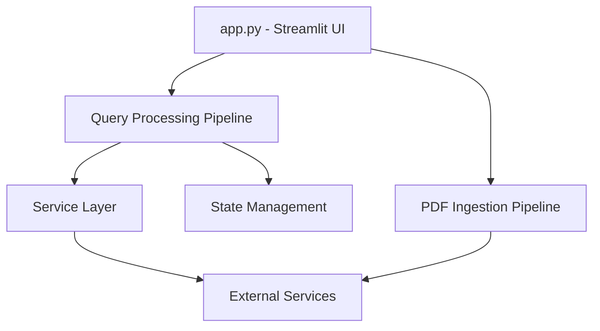

# Research Gap Discovery and Industry Alignment Agent Pipeline

## Overview
This document outlines the complete data flow pipeline for the Research Gap Discovery and Industry Alignment Agent, showing how data flows between components and nodes.



---

# 📁 COMPONENT: app.py

**Type:** User Interface Layer  
**Technology:** Streamlit  
**Responsibilities:** File upload handling, chat interface, model selection, session management

## Input Data
- Uploaded PDF files (via file uploader)
- User queries (via chat interface)
- Model selection (oss20b/oss120b)

## Output Data
- Serialized file payloads
- Processing status updates
- Generated responses and visualizations

## Connected To
- [[#uploader.py]] - File normalization
- [[#pdf_ingestion.py]] - PDF processing
- [[#chat.py]] - Chat payload building
- [[#basic_qa_graph.py]] - Query orchestration

## Functions
```python
save_uploaded_pdfs(uploaded_files) → List[str]
get_pdf_details(uploaded_file) → dict
initialize_state() → None
render_upload_section() → UI components
```

---

# 📁 COMPONENT: uploader.py

**Type:** File Processing Utility  
**Location:** `src/research_gap_agent/ui/uploader.py`  
**Responsibilities:** File normalization and serialization

## Input Data
- List of uploaded file objects from Streamlit

## Output Data
- Normalized filenames (List[str])
- Serialized file payloads (List[dict])

## Data Transformation
```python
# Input: Streamlit UploadedFile objects
[UploadedFile, UploadedFile, ...]

# Process: normalize_uploaded_files()
["paper1.pdf", "paper2.pdf", ...]

# Process: serialize_uploaded_files()
[
  {"name": "paper1.pdf", "content": bytes},
  {"name": "paper2.pdf", "content": bytes}
]
```

## Connected To
- [[#app.py]] - Receives uploaded files
- [[#pdf_ingestion.py]] - Provides normalized files

---

# 📁 COMPONENT: pdf_ingestion.py

**Type:** Ingestion Orchestrator  
**Location:** `src/research_gap_agent/Ingestion/pdf_ingestion.py`  
**Responsibilities:** Complete PDF ingestion pipeline coordination

## Input Data
- PDF file path (str)
- Optional timestamp (int)

## Output Data
```python
{
    "full_text": str,
    "metadata": {
        "title": str,
        "author": str,
        "page_count": int,
        "filename": str,
        "source": str,
        "ingestion_timestamp": int
    },
    "chunks": List[dict],
    "chunk_count": int,
    "embedded_chunks": List[dict],
    "embedded_chunk_count": int,
    "pinecone_upsert_stats": dict
}
```

## Pipeline Steps
1. [[#parser.py]] - Extract text and metadata
2. [[#semantic_chunker.py]] - Split into semantic chunks
3. [[#embedder.py]] - Generate embeddings
4. [[#pinecone_upsert.py]] - Upload to vector database

## Connected To
- [[#uploader.py]] - Receives normalized files
- [[#parser.py]] - Calls for text extraction
- [[#semantic_chunker.py]] - Calls for chunking
- [[#embedder.py]] - Calls for embeddings
- [[#pinecone_upsert.py]] - Calls for vector upload

---

# 📁 COMPONENT: parser.py

**Type:** PDF Text Extraction  
**Location:** `src/research_gap_agent/Ingestion/parser.py`  
**Responsibilities:** High-quality text extraction from PDFs

## Input Data
- PDF file path (str)

## Output Data
```python
{
    "full_text": str,
    "metadata": {
        "title": str,
        "author": str,
        "page_count": int,
        "parser": str  # "pymupdf4llm" or "pymupdf_fallback"
    }
}
```

## Processing Flow
```
PDF File
    ↓
Try pymupdf4llm.to_markdown()
    ↓ Success
Return enhanced markdown text
    ↓ Failure
Fallback to PyMuPDF basic extraction
    ↓
Return extracted text with metadata
```

## Methods
- `_parse_with_pymupdf4llm()` - Primary parsing method
- `_parse_with_pymupdf()` - Fallback parsing method
- `_normalize_text()` - Text cleaning and normalization

## Connected To
- [[#pdf_ingestion.py]] - Called by ingestion orchestrator
- External: pymupdf4llm library
- External: PyMuPDF library

---

# 📁 COMPONENT: semantic_chunker.py

**Type:** Document Chunking  
**Location:** `src/research_gap_agent/Ingestion/semantic_chunker.py`  
**Responsibilities:** Split documents into semantic chunks

## Input Data
```python
{
    "text": str,
    "metadata": dict
}
```

## Output Data
```python
[
    {
        "chunk_id": str,
        "text": str,
        "metadata": dict
    },
    ...
]
```

## Processing Steps
1. Remove references section (if present at end)
2. Remove administrative/footer content
3. Extract abstract and introduction for better retrieval
4. Create summary chunk for generic queries
5. Perform semantic chunking based on content boundaries

## Connected To
- [[#pdf_ingestion.py]] - Called after parsing
- [[#embedder.py]] - Provides chunks for embedding

---

# 📁 COMPONENT: embedder.py

**Type:** Embedding Generation  
**Location:** `src/research_gap_agent/Ingestion/embedder.py`  
**Responsibilities:** Generate vector embeddings for text chunks

## Input Data
```python
[
    {
        "chunk_id": str,
        "text": str,
        "metadata": dict
    },
    ...
]
```

## Output Data
```python
[
    {
        "chunk_id": str,
        "text": str,
        "metadata": dict,
        "embedding": List[float]  # 384 dimensions
    },
    ...
]
```

## Configuration
- Model: jina-embeddings-v2
- Dimensions: 384
- Service: Jina AI Embedding API

## Connected To
- [[#pdf_ingestion.py]] - Called during ingestion
- [[#retrieval.py]] - Used for query embedding
- External: Jina AI Embedding API

---

# 📁 COMPONENT: pinecone_upsert.py

**Type:** Vector Database Upload  
**Location:** `src/research_gap_agent/Ingestion/pinecone_upsert.py`  
**Responsibilities:** Upload embedded chunks to Pinecone vector database

## Input Data
```python
[
    {
        "chunk_id": str,
        "text": str,
        "metadata": dict,
        "embedding": List[float]
    },
    ...
]
```

## Output Data
```python
{
    "total_uploaded_vectors": int,
    "skipped_invalid_vectors": int,
    "namespace": str
}
```

## Processing Steps
1. Connect to Pinecone index "researchassistant"
2. Generate namespace from filename
3. Batch upsert vectors with metadata
4. Return upload statistics

## Pinecone Configuration
- Index: researchassistant
- Dimension: 384
- Namespace: Per PDF file (filename-based)

## Connected To
- [[#pdf_ingestion.py]] - Called after embedding
- External: Pinecone Vector Database

---

# 📁 COMPONENT: chat.py

**Type:** Chat Interface Utility  
**Location:** `src/research_gap_agent/ui/chat.py`  
**Responsibilities:** Build chat payload for query processing

## Input Data
- messages: List[dict] (conversation history)
- uploaded_files: List[str] (filenames)
- file_payloads: List[dict] (serialized files)
- parsed_documents: List[dict] (ingested docs)
- user_query: str

## Output Data
```python
{
    "messages": List[dict],
    "user_query": str,
    "uploaded_files": List[str],
    "file_payloads": List[dict],
    "parsed_documents": List[dict]
}
```

## Connected To
- [[#app.py]] - Called for query processing
- [[#basic_qa_graph.py]] - Provides payload for graph execution

---

# 📁 COMPONENT: basic_qa_graph.py

**Type:** LangGraph Orchestration  
**Location:** `src/research_gap_agent/graphs/basic_qa_graph.py`  
**Responsibilities:** Coordinate query processing workflow

## Graph Structure
```
START → retrieval → web_search → generator → mindmap → END
```

## Input Data
- ResearchState with user query and context

## Output Data
- Updated ResearchState with answer and results

## Node Sequence
1. [[#retrieval.py]] - Retrieve relevant documents
2. [[#web_search.py]] - Perform web search (conditional)
3. [[#generator.py]] - Generate answer
4. [[#mindmap_node.py]] - Generate mindmap (conditional)

## Connected To
- [[#chat.py]] - Receives chat payload
- [[#state.py]] - Uses ResearchState
- [[#retrieval.py]] - First node in workflow
- [[#web_search.py]] - Second node
- [[#generator.py]] - Third node
- [[#mindmap_node.py]] - Final node

---

# 📁 COMPONENT: state.py

**Type:** State Management  
**Location:** `src/research_gap_agent/state/state.py`  
**Responsibilities:** Define and manage agent state

## State Structure (ResearchState)

### Conversational State
```python
messages: Annotated[List[BaseMessage], add_messages]
query: str
selected_llm: Optional[str]
```

### Document State
```python
uploaded_files: List[str]
file_payloads: List[Dict[str, Any]]
parsed_documents: List[Dict[str, Any]]
target_namespace: Optional[str]
```

### Retrieval State
```python
retrieved_docs: Optional[List[Dict[str, Any]]]
web_search_performed: bool
web_search_results: Optional[Dict[str, Any]]
web_search_query: Optional[str]
pdf_context_sufficient: bool
```

### Generation State
```python
answer: Optional[str]
mindmap_generated: bool
mindmap_data: Optional[Dict[str, Any]]
```

### Analysis State
```python
metadata: Dict[str, PaperMetadata]
analysis_results: Dict[str, AnalysisResults]
cross_paper_gaps: List[str]
industry_gap_alignment: Dict[str, Any]
```

### Flow Control
```python
current_node: str
errors: List[str]
```

## Connected To
- [[#basic_qa_graph.py]] - Used by all nodes
- [[#retrieval.py]] - Updates with retrieved docs
- [[#web_search.py]] - Updates with web results
- [[#generator.py]] - Updates with answer
- [[#mindmap_node.py]] - Updates with mindmap

---

# 📁 COMPONENT: retrieval.py

**Type:** Document Retrieval Node  
**Location:** `src/research_gap_agent/nodes/retrieval.py`  
**Responsibilities:** Retrieve relevant documents from vector database

## Input Data
- ResearchState with query and target_namespace

## Processing Steps
1. Extract query from state
2. Enhance query with conversation history
3. Generate query embedding using [[#embedder.py]]
4. Query Pinecone vector database
5. Parse and rank results
6. Update state with retrieved documents

## Output Data
```python
{
    "retrieved_docs": [
        {
            "id": str,
            "score": float,
            "metadata": dict,
            "text": str
        },
        ...
    ]
}
```

## Configuration
- Top-K: 10 documents
- Embedding dimension: 384
- Namespace search: Target or all namespaces

## Connected To
- [[#basic_qa_graph.py]] - Called as first node
- [[#embedder.py]] - Uses for query embedding
- [[#state.py]] - Updates with retrieved docs
- External: Pinecone Vector Database

---

# 📁 COMPONENT: web_search.py

**Type:** Web Search Node  
**Location:** `src/research_gap_agent/nodes/web_search.py`  
**Responsibilities:** Perform web search for additional context

## Input Data
- ResearchState with query and retrieved docs

## Processing Steps
1. Check if web search is needed (oss120b only)
2. Perform Tavily search with query
3. Extract content from URLs using Jina AI
4. Rank and chunk results
5. Update state with web search results

## Output Data
```python
{
    "web_search_performed": bool,
    "web_search_results": {
        "web_search_performed": bool,
        "top_k_chunks": [
            {
                "chunk_number": int,
                "text": str,
                "url": str,
                "relevance_score": float
            },
            ...
        ],
        "fallback_answer": str
    },
    "web_search_query": str
}
```

## Connected To
- [[#basic_qa_graph.py]] - Called as second node
- [[#tavily_service.py]] - Uses for web search
- [[#jina_service.py]] - Uses for content extraction
- [[#state.py]] - Updates with web results

---

# 📁 COMPONENT: generator.py

**Type:** Answer Generation Node  
**Location:** `src/research_gap_agent/nodes/generator.py`  
**Responsibilities:** Generate final answer using RAG

## Input Data
- ResearchState with query, retrieved docs, and web results

## Processing Steps
1. Build RAG prompt with context
2. Get LLM from [[#llm/factory.py]]
3. Generate answer using selected model
4. Handle token limits and context truncation
5. Update state with generated answer

## Prompt Construction
```python
# Context sources:
- Retrieved PDF documents (prioritized)
- Web search results (supplementary)
- Conversation history (for follow-up)

# Instructions:
- Prioritize PDF content
- Cite sources (documents and websites)
- Avoid hallucination
- Be specific and evidence-based
```

## Output Data
```python
{
    "answer": str  # Generated response
}
```

## Model Configuration
- oss20b: 3000 tokens, fast inference
- oss120b: 4000 tokens, advanced reasoning

## Connected To
- [[#basic_qa_graph.py]] - Called as third node
- [[#llm/factory.py]] - Gets LLM instance
- [[#state.py]] - Updates with answer
- [[#mindmap_node.py]] - Provides answer for mindmap

---

# 📁 COMPONENT: mindmap_node.py

**Type:** Mindmap Generation Node  
**Location:** `src/research_gap_agent/nodes/mindmap_node.py`  
**Responsibilities:** Generate structured mindmap from answer

## Input Data
- ResearchState with generated answer

## Processing Steps
1. Check if mindmap generation is enabled (oss120b only)
2. Extract concepts and relationships from answer
3. Generate structured mindmap data
4. Update state with mindmap data

## Output Data
```python
{
    "mindmap_generated": bool,
    "mindmap_data": {
        "main_concept": str,
        "nodes": [
            {
                "id": str,
                "label": str
            },
            ...
        ],
        "edges": [
            {
                "from": str,
                "to": str
            },
            ...
        ]
    }
}
```

## Connected To
- [[#basic_qa_graph.py]] - Called as final node
- [[#state.py]] - Updates with mindmap data
- [[#app.py]] - Displays mindmap visualization

---

# 📁 COMPONENT: llm/factory.py

**Type:** LLM Factory  
**Location:** `src/research_gap_agent/llm/factory.py`  
**Responsibilities:** Create and manage LLM instances

## Input Data
- model_name: str ("oss20b" or "oss120b")

## Output Data
- LLM instance for specified model

## Model Instances
- [[#llm/oss20B.py]] - Fast inference model
- [[#llm/oss120B.py]] - Advanced reasoning model

## Connected To
- [[#generator.py]] - Provides LLM for generation
- [[#llm/oss20B.py]] - Creates oss20b instances
- [[#llm/oss120B.py]] - Creates oss120b instances

---

# 📁 COMPONENT: llm/oss20B.py

**Type:** LLM Implementation  
**Location:** `src/research_gap_agent/llm/oss20B.py`  
**Responsibilities:** OSS 20B model implementation

## Configuration
- Token limit: 3000
- Use case: Fast inference
- Priority: Speed over complexity

## Connected To
- [[#llm/factory.py]] - Managed by factory
- [[#generator.py]] - Used for generation

---

# 📁 COMPONENT: llm/oss120B.py

**Type:** LLM Implementation  
**Location:** `src/research_gap_agent/llm/oss120B.py`  
**Responsibilities:** OSS 120B model implementation

## Configuration
- Token limit: 4000
- Use case: Advanced reasoning
- Priority: Quality over speed

## Connected To
- [[#llm/factory.py]] - Managed by factory
- [[#generator.py]] - Used for generation

---

# 📁 COMPONENT: tavily_service.py

**Type:** Web Search Service  
**Location:** `src/research_gap_agent/services/tavily_service.py`  
**Responsibilities:** Tavily search API integration

## Input Data
- search_query: str
- max_results: int

## Output Data
```python
{
    "results": [
        {
            "url": str,
            "title": str,
            "snippet": str
        },
        ...
    ]
}
```

## Connected To
- [[#web_search.py]] - Provides web search results
- External: Tavily Search API

---

# 📁 COMPONENT: jina_service.py

**Type:** Content Extraction Service  
**Location:** `src/research_gap_agent/services/jina_service.py`  
**Responsibilities:** Jina AI content extraction

## Input Data
- url: str

## Output Data
```python
{
    "extracted_content": [
        {
            "url": str,
            "key_information": str,
            "status": str
        },
        ...
    ]
}
```

## Connected To
- [[#web_search.py]] - Provides extracted content
- External: Jina AI Reader API

---

# 📁 COMPONENT: pinecone_service.py

**Type:** Vector Database Service  
**Location:** `src/research_gap_agent/services/pinecone_service.py`  
**Responsibilities:** Pinecone database operations

## Functions
- Connection management
- Index operations
- Query operations
- Namespace management

## Connected To
- [[#retrieval.py]] - Supports retrieval operations
- [[#pinecone_upsert.py]] - Supports upsert operations
- External: Pinecone Vector Database

---

# 📁 COMPONENT: embedding_service.py

**Type:** Embedding Service  
**Location:** `src/research_gap_agent/services/embedding_service.py`  
**Responsibilities:** Embedding generation operations

## Configuration
- Model: jina-embeddings-v2
- Dimensions: 384
- API: Jina AI Embedding API

## Connected To
- [[#embedder.py]] - Core embedding logic
- [[#retrieval.py]] - Query embedding
- External: Jina AI Embedding API

---

# 📁 COMPONENT: reranker_service.py

**Type:** Result Reranking Service  
**Location:** `src/research_gap_agent/services/reranker_service.py`  
**Responsibilities:** Rerank search results for better relevance

## Input Data
- List of search results
- Original query

## Output Data
- Reranked results with updated scores

## Connected To
- [[#retrieval.py]] - Potential use for result refinement
- [[#web_search.py]] - Potential use for web result ranking

---

# 📁 COMPONENT: crawler_service.py

**Type:** Web Crawling Service  
**Location:** `src/research_gap_agent/services/crawler_service.py`  
**Responsibilities:** Web crawling for additional content

## Functions
- URL crawling
- Content extraction
- Link discovery

## Connected To
- [[#web_search.py]] - Potential use for deep content extraction
- External: Web pages

---

# 📁 COMPONENT: file_store.py

**Type:** File Storage Utility  
**Location:** `src/research_gap_agent/utils/file_store.py`  
**Responsibilities:** File storage operations

## Functions
- Save uploaded files to data/uploads/
- File path management
- Directory creation and validation

## Connected To
- [[#app.py]] - Used for file storage
- File system: data/uploads/ directory

---

# 🔌 EXTERNAL: Pinecone Vector Database

**Type:** External Service  
**Purpose:** Vector storage and similarity search

## Configuration
- Index: researchassistant
- Dimension: 384
- Namespaces: Per PDF file

## Operations
- Upsert: Upload vectors with metadata
- Query: Similarity search with embeddings
- Describe: Index statistics and namespaces

## Connected To
- [[#pinecone_upsert.py]] - Uploads vectors
- [[#retrieval.py]] - Queries for similar vectors
- [[#pinecone_service.py]] - Service layer operations

---

# 🔌 EXTERNAL: Tavily Search API

**Type:** External Service  
**Purpose:** Real-time web search

## Capabilities
- Real-time search results
- AI-generated answers
- URL and snippet extraction

## Connected To
- [[#tavily_service.py]] - Service layer integration
- [[#web_search.py]] - Web search node

---

# 🔌 EXTERNAL: Jina AI APIs

**Type:** External Services  
**Purpose:** Embedding and content extraction

## Services
- **Jina Embeddings**: Text to vector conversion
- **Jina Reader**: Web content extraction

## Connected To
- [[#embedder.py]] - Embedding generation
- [[#embedding_service.py]] - Embedding operations
- [[#jina_service.py]] - Content extraction
- [[#web_search.py]] - Web content processing

---

# 🔌 EXTERNAL: LLM Models

**Type:** External Models  
**Purpose:** Text generation and reasoning

## Models
- **OSS 20B**: Fast inference (3000 tokens)
- **OSS 120B**: Advanced reasoning (4000 tokens)

## Connected To
- [[#llm/factory.py]] - Model management
- [[#llm/oss20B.py]] - OSS 20B implementation
- [[#llm/oss120B.py]] - OSS 120B implementation
- [[#generator.py]] - Answer generation

---

# 📊 DATA FLOW SUMMARY

## Ingestion Pipeline
```
app.py → uploader.py → pdf_ingestion.py → parser.py → semantic_chunker.py → embedder.py → pinecone_upsert.py → Pinecone DB
```

## Query Pipeline
```
app.py → chat.py → basic_qa_graph.py → retrieval.py → web_search.py → generator.py → mindmap_node.py → state.py
```

## State Flow
```
Initial State → retrieval (retrieved_docs) → web_search (web_results) → generator (answer) → mindmap (mindmap_data) → Final State
```

---

# 🏷️ TAGS

#architecture #pipeline #research #agent #ingestion #retrieval #generation #llm #vector-database #web-search #state-management